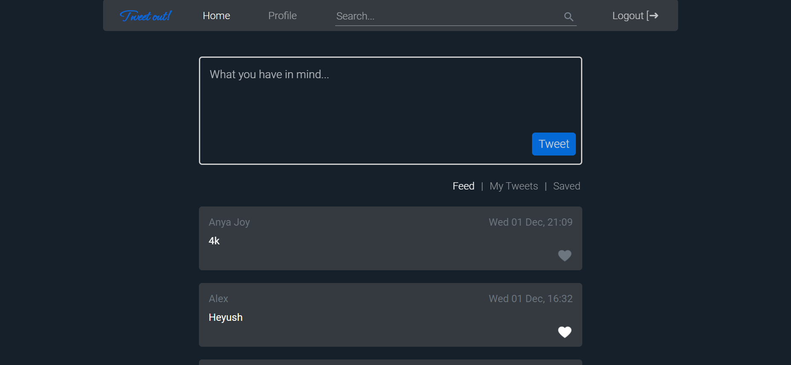

In development...

Deployed link: https://tweet-out.web.app

# Tweeting App Project

Micro-blogging web application. Home task from the first month of Front-end course. In this project I was practicing my vanila JavaScript and raw CSS/HTML skills, while using Firebase for back-end. Looking back at it now - that's when I fell in love with coding.

## Table of contents

- [Overview](#overview)
  - [The challenge](#the-challenge)
  - [Screenshot](#screenshot)
  - [Links](#links)
- [My process](#my-process)
  - [Built with](#built-with)
  - [What I learned](#what-i-learned)
- [Author](#author)
- [Acknowledgments](#acknowledgments)

## Overview

### The challenge

Users should be able to:

- View the desktop layout
- See hover states for interactive elements
- Register and login into the app using a custom password or Google auth
- View a feed of messages from all users
- Send thier messages to the common feed
- Like(save) other people's messages
- View only thier/saved messages
- Search messages by their content or author

### Screenshot

### Links

- Live Site URL: [tweet-out.web.app](https://tweet-out.web.app)

## My process

### Built with

- Semantic HTML5 markup
- CSS custom properties
- Flexbox
- Mobile-first workflow
- [React](https://reactjs.org/) - JS library
- [Styled Components](https://styled-components.com/) - For styles
- Firebase

### What I learned
In this project:
- I got a 'touch' of back-end using Firebase api's for storing, altering, deleting and retriving data from a database and storage.
- I used react router dom to switch between pages
- Set up and implemented private routes and authorization

## Author

Github Profile - @AnyaJoy

## Acknowledgments

This project was a part of Front-end development course from ITC. They provided the design and technical plan! It was fun making it and made me consider moving forward with learning back-end as well!

